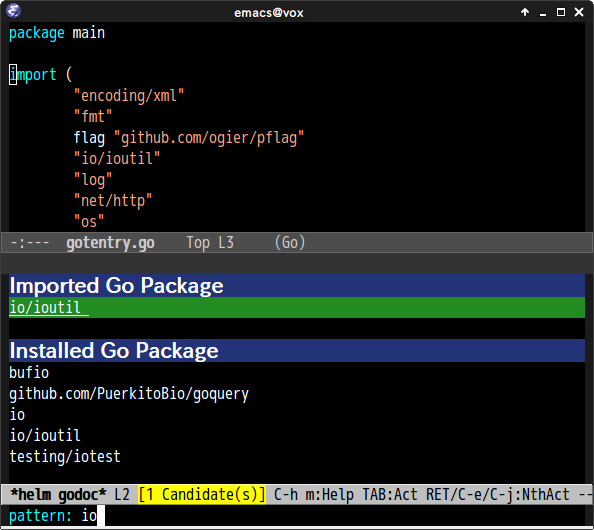

# helm-godoc.el [](https://travis-ci.org/syohex/emacs-helm-godoc)

## Introduction

`helm-godoc.el` is `godoc` helm interface

I wrote this package only for my use case.
You should use [helm-go-package](https://github.com/yasuyk/helm-go-package).
It has much features than this package.


## Screenshot




## Requirements

* Emacs 24 or higher
* helm 1.0 or higher


## Basic Usage

#### `helm-godoc`

`godoc` with helm interface

#### `helm-godoc-at-point`

Pop up document of `function`/`type` at point

## Actions

* View package document
* View source code
* Import module


## Sample Configuration

```elisp
(autoload 'helm-godoc "helm-godoc" nil t)
(define-key go-mode-map (kbd "C-c C-d") 'helm-godoc)
```
